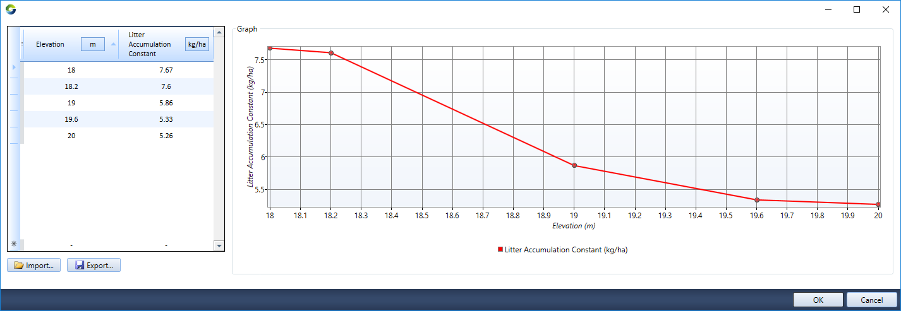
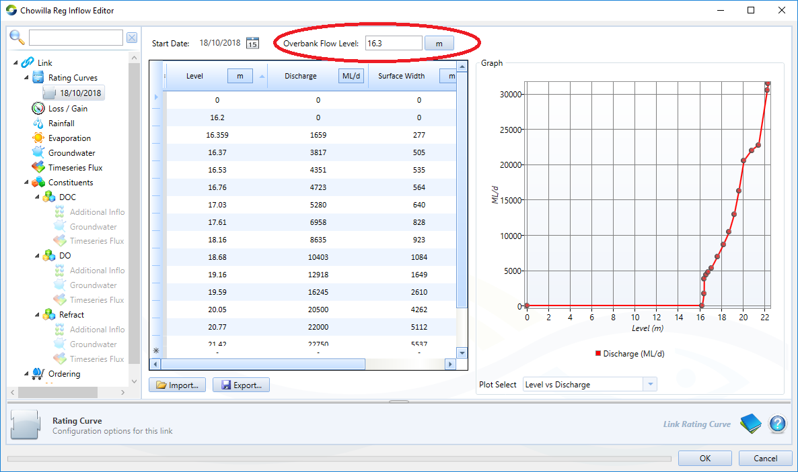
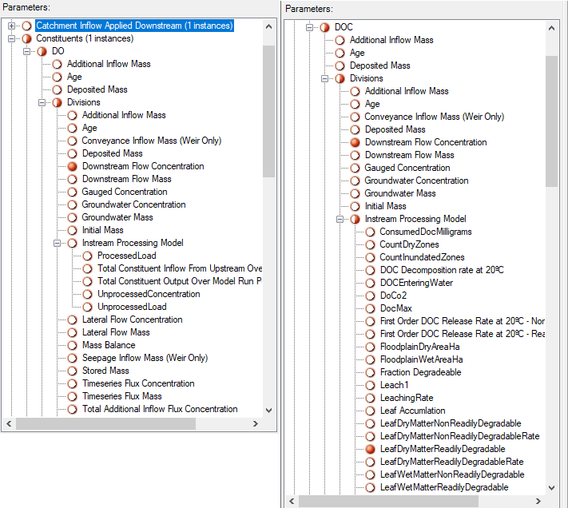
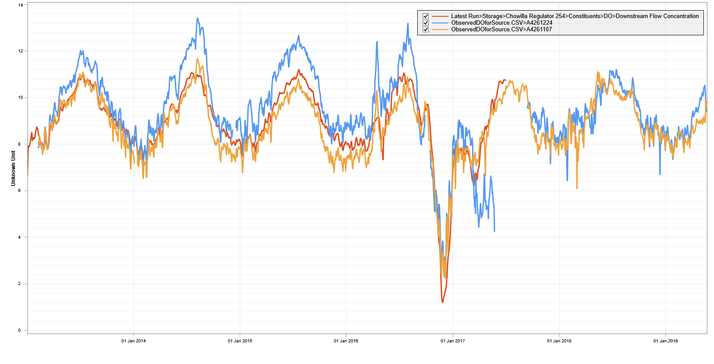
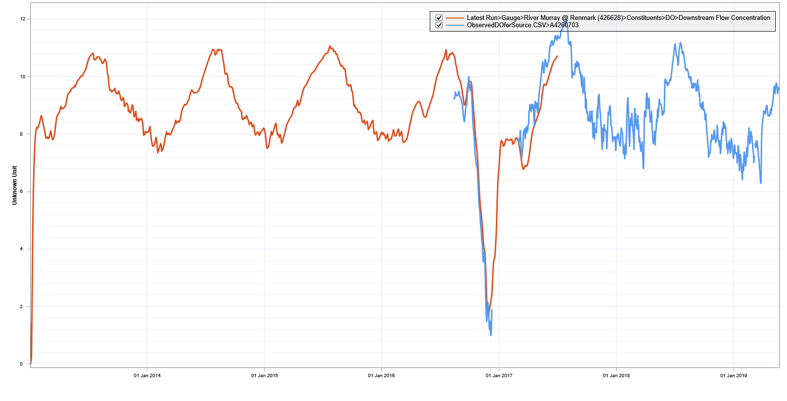

# Dissolved Oxygen / Dissolved Organic Carbon plugin for eWater Source

A plugin to eWater Source for modelling blackwater events, as described in Mosley et al. (2021).

## References:
Mosley, LM, Wallace T, Rahman J, Roberts T, Gibbs M (2021). An integrated model to predict and prevent hypoxia in floodplain-river systems. Journal of Environmental Management https://doi.org/10.1016/j.jenvman.2021.112213

## Instructions

The Blackwater Plugin needs to be added using the “Tools”, “Plugin Manager” menu in Source. Click the "Browse" button, and by default this will open in the plugins folder where Source is installed. Go into the "Community Plugins" folder and load the plugin file (FlowMatters.Source.DODOC.dll), and follow the prompts for Source to restart.

An example Source model, as used in Mosley et al. (2021) is available [here](https://github.com/matt-s-gibbs/DODOC_SA_Calib), in the Model folder. This model was tested using Source version 5.4. It includes scenarios for the "split" and "lumped" scenarios, and the screen shots below are taken from this model.

## Configuring the DODOC model

### Setup constituents
To start, the constituents for Source to track must be added. Click on the ‘Edit’, ‘Constituents’ sub-menu (from the top menu). Check that the ‘Constituents Enabled’ box is ticked. Type the name of constituents. Note for the this blackwater plugin you need to specify *both* DO and DOC. In this example, Salinity has also been added to the list of constituents.

See the [Source User Guide](https://wiki.ewater.org.au/display/SD54/Constituents) for information on the difference between Lumped and Marker routing. Improvements Marker routing in Source, particularly for weir nodes, were made in version 5.4. 

### Setup inflow concentrations
Click on ‘Edit’ following right clicking on the inflow node ("Inflow 28" in the example model above) in the schematic or geographic editor, or the inflow in the ‘Project Hierachy’ menu (left hand side menu of the main program window). The inflow flow rate and input concentrations can be typed in the box or a time series or function created.

### Setup DODOC model parameters
Right click on a Storage node (e.g. "Chowilla Regulator 254") and click ‘Edit’. Then click on the ‘Constituents’ menu item. The Initial concentrations in the storage are set by typing in the ‘Initial Concentration’ column.

The main functionality of the blackwater model is activated by selecting ‘StorageDO’ and ‘StorageDOC’ under the 'Processing Model’ column for DO and DOC constituents respectively. This will bring up a ‘Configure’ link under the ‘Options’ column.

The DO model configuration window has only one parameter, that is the ‘Floodplain Elevation’. This is the level that the floodplain become “Active” in terms of the blackwater model functionality, where above this elevation the organic matter is tracked. Below this elevation there is no litter in the model, typically used to represent permanent water. 

The DOC model configuration window has multiple parameters, see Mosley et al. (2021) for a description.

Here you can see some parameter values as set using a function (blue text starting with a $), or a time series (Water Temperature). These can be set by clicking on "...". Using functions in this way allows the same value to be referenced across nodes from one location (the function), which is useful for calibrating a suitable value across all nodes. The editors at the bottom (e.g. "Litter Accumulation Constant") allow variable initial litter loads and accumulation rates to be specified along the elevation gradient. In this example there is a higher accumulation rate at the lower elevations that are inundated more frequently, from more dense vegetation or the particular vegetation type, and then the rate of litter accumulation decreases further up the floodplain elevation.

 The link Routing Type needs to be defined as “Storage Routing” (by right clicking on link). If the number of link divisions (# Divisions) is increased from 1 the processing part of the model will be activated on all the divisions specified in the link. This could be useful for finer resolution of the Blackwater (DO and DOC constituent) behaviour within a river reach. Since Source version 5.4, Weir nodes also adopt this link style processing on each division.
 

 To activate the instream Blackwater functionality, under the Link constituent sub-meu select “InStreamDO” and “InstreamDOC” for the processing models for DO and DOC respectively.

 

The procedure in the Blackwater Plugin for configuring Links is almost exactly the same as a storage. The only difference is the elevation for the active floodplain is not an input parameter, and is instead derived from the Overbank Flow Level on the rating curve.

## Running the model

Click ‘OK’ as required to return to the main Source window and run the models using the “Run” button (as per normal in Source). The DO and DOC outputs (called "Recorders" in Source) are found in the ‘Constituents’ menu for the relevant output point. In the parameters window, right click on an recorder and select record all for an output to be available in the Results Manager after a model run. Below the recorders under the DO and DOC constituents can be seen.

 For storages, the “stored concentration” gives the commonly required output of DO and DOC on the floodplain in mg/L, for links “downstream concentration” gives the commonly required output at the end of the link. The various other components of the Blackwater model (e.g. mass of litter on the floodplain, or processing rates) can be found under the ‘Processing’ sub-menu within the particular Constituent menu (i.e. mostly under the DOC constituent menu). The results below were derived using the model linked to above, using the Split scenario, and compared to observed data from within the Chowilla Anabranch as well as the River Murray.
 
 
 
 

