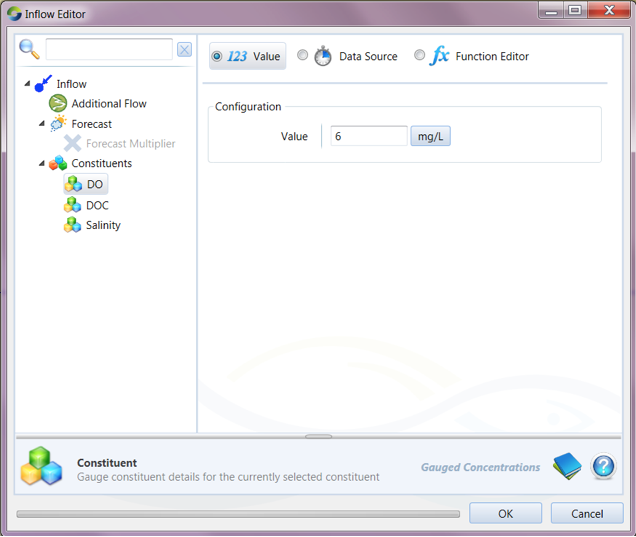
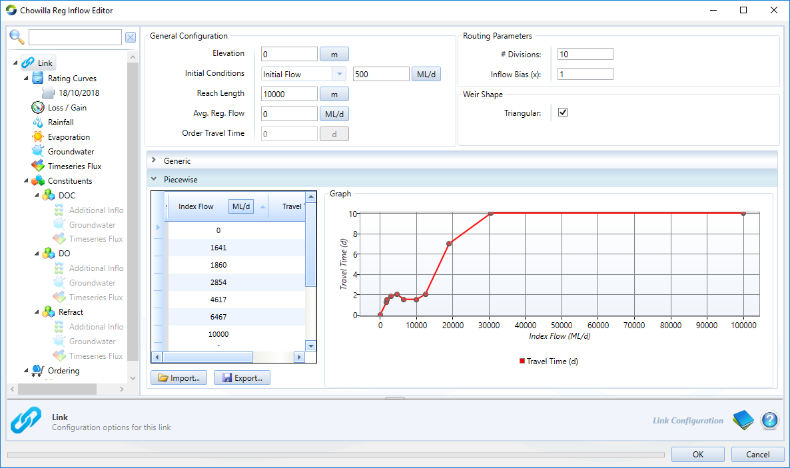

# Dissolved Oxygen / Dissolved Organic Carbon plugin for eWater Source

A plugin to eWater Source for modelling blackwater events, based primarily on the model framework of Howitt et al. (2007).

## References:
Howitt JA, Baldwin DS, Rees GN and Williams JL (2007). Modelling blackwater: predicting water quality during flooding of lowland river forests. Ecological Modelling 203 (3–4):229–242. doi:10.1016/j.ecolmodel.2006.11.017 

## Instructions

The Blackwater Plugin needs to be added using the “Tools”, “Plugin Manager” menu in Source, navigating to the plugin file (FlowMatters.Source.DODOC.dll), and following the prompts. The current plugin has been developed and tested in Source 4.2.4.

## Configuring a storage/floodplain model

In this example we create a simple floodplain model:

The model has a single ‘Inflow’ node, the first ‘link’ (L1, e.g. representing a channel) leading to a floodplain “Storage” node, and outflow to a downstream link (L2) and ‘Gauge’.

Click on the ‘Edit’, ‘Constituents’ sub-menu (from the top menu). Check that the ‘Constituents Enabled’ box is ticked. Type the name of constituents. Note for the this blackwater plugin you need to specify BOTH DO and DOC. In this example, Salinity has also been added to the list of constituents.

Click on ‘Edit’ following right clicking on the inflow node in the schematic or geographic editor, or the inflow in the ‘Project Hierachy’ menu (left hand side menu of the main program window). The inflow flow rate and input concentrations can be typed in the box or a time series or function created. In this example, a constant DO concentration of 6 mg/L has been specified in the Inflow.

Similarly, right click on the Storage node and click ‘Edit’. Then click on the ‘Constituents’ menu item. The Initial concentrations in the storage/floodplain are set by typing in the ‘Initial Concentration’ column.

The main functionality of the blackwater model is activated by selecting ‘StorageDO’ and ‘StorageDOC’ under the “Processing Model’ column for DO and DOC constituents respectively. This will bring up a ‘Configure’ link under the ‘Options’ column.

The DO model configuration window has only one parameter, that is the ‘Floodplain Elevation’. This is the level that the floodplain become “Active” in terms of the blackwater model functionality.

The DOC model configuration window has multiple parameters:

## Configuring a link/river channel component of the Blackwater plugin model

The procedure in the Blackwater Plugin for configuring Links is similar. First the link Routing Type needs to be defined as “Storage Routing” (by right clicking on link). The various general configuration values can be inputted (refer to Source user guide). If the number of link divisions (# Divisions) is increased from 1 the processing part of the model will be activated on all the divisions specified in the link. This could be useful for finer resolution of the Blackwater (DO and DOC constituent) behavior within a river reach.

To activate the instream Blackwater functionality, under the Link constituent sub-meu select “InStreamDO” and “InstreamDOC” for the processing models for DO and DOC respectively.

The following is an example of the two key parameters to be configured for instream DO and DOC processing, the DOC consumption coefficient and the reaeration coefficient. Other parameters can be left at zero, although the link model can also be configured to operate as a floodplain storage. This requires specification of a rating table.

## Running the model

Click ‘OK’ as required to return to the main Source window and run the models using the “Run” button (as per normal in Source). The outputs can be viewed in the Source “Results Manager” accessible from the Tools menu. The DO and DOC outputs are found in the ‘Constituents’ menu for the relevant output point. For storages, the “stored concentration” gives the commonly required output of DO and DOC on the floodplain in mg/L, for links “downstream concentration” gives the commonly required output at the end of the link. The various other components of the Blackwater model can be found under the ‘Processing’ sub-menu within the particular Constituent menu (i.e. mostly under the DOC constituent menu).

